# HexBadge


[](CONTRIBUTING.md)
[](SECURITY.md)

**Plataforma self-hosted de credenciales digitales y diplomas verificables** — Open Badges 2.0, certificados en PDF, multiempresa, en **PHP 8.3 puro** (sin frameworks, sin Composer, sin binarios externos). Pensada para correr tanto en Docker como en **hosting compartido / cPanel**.

> Emití acreditaciones a nombre de tu organización, que las personas pueden aceptar, sumar a su perfil de LinkedIn y compartir con un enlace que **cualquiera puede verificar** — sin exponer datos sensibles.

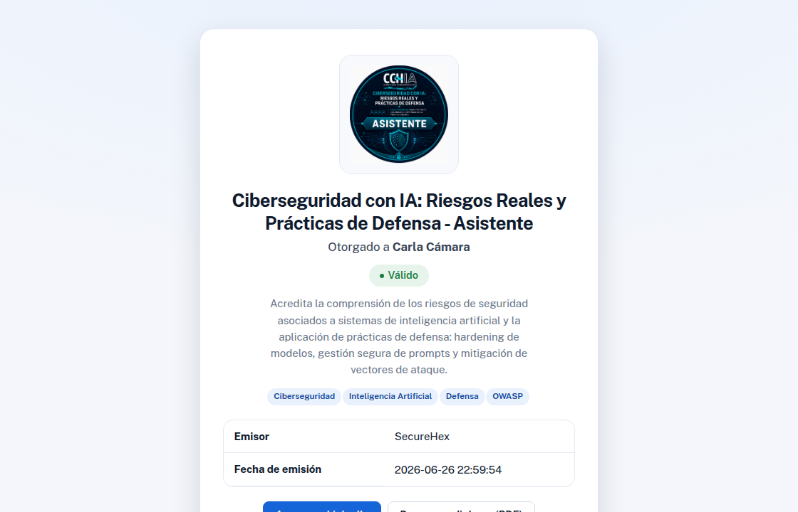

---

## ✨ Características

### Credenciales y verificación
- **Open Badges 2.0**: cada acreditación expone su _assertion_ JSON-LD (`/verify/{uuid}.json`) y su _BadgeClass_, compatibles con el estándar.
- **Página de verificación pública** por UUID: muestra emisor, receptor, estado (válido / revocado / expirado), criterios y skills.
- **Integración con LinkedIn**: botón "Agregar al perfil" (certificaciones) y compartir, con el _Organization ID_ por empresa para mostrar el logo oficial.
- **QR en PHP puro**: generación de códigos QR sin librerías ni `exec` (funciona en hosting compartido).

### Certificados / diplomas en PDF
- Subí una **imagen de plantilla** por template y **marcá visualmente** dónde va cada dato: nombre, QR de verificación, ID, fecha y curso.
- **Vista previa en vivo**: el texto de muestra se renderiza con la tipografía, color, alineación y tamaño elegidos.
- **Tipografías propias**: usá las incluidas (Public Sans, Playfair Display) o **subí tus .ttf/.otf**.
- Genera un **PDF** por persona, entregado como enlace de descarga en el correo y en la página de verificación.

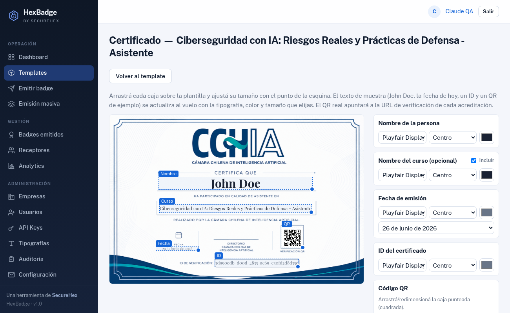

### Emisión
- **Templates de badges** con imagen, criterios, skills, expiración y visibilidad.
- **Emisión individual** y **masiva por CSV** (mapeo de columnas por nombre, hasta 2000 filas, envío por lotes con una sola conexión SMTP).
- **Correo de notificación** con la marca de la empresa, enlace de aceptación y descarga del diploma.
- **Reenvío** de correos y **revocación** con motivo.

### Multiempresa (multitenancy)
- Cada **Empresa** es un espacio aislado: sus templates, badges, receptores, usuarios, auditoría y métricas **no se mezclan** con los de otras.
- Los **datos del emisor** (nombre, URL, email, LinkedIn Org) se centralizan en la empresa y los heredan todos sus badges.
- **SMTP propio por empresa** (opcional): por defecto se usa el SMTP global de la plataforma; cada empresa puede configurar el suyo y solo afecta a sus correos.
- El **superadmin** ve todo y filtra por empresa; cada **admin** gestiona únicamente la suya.

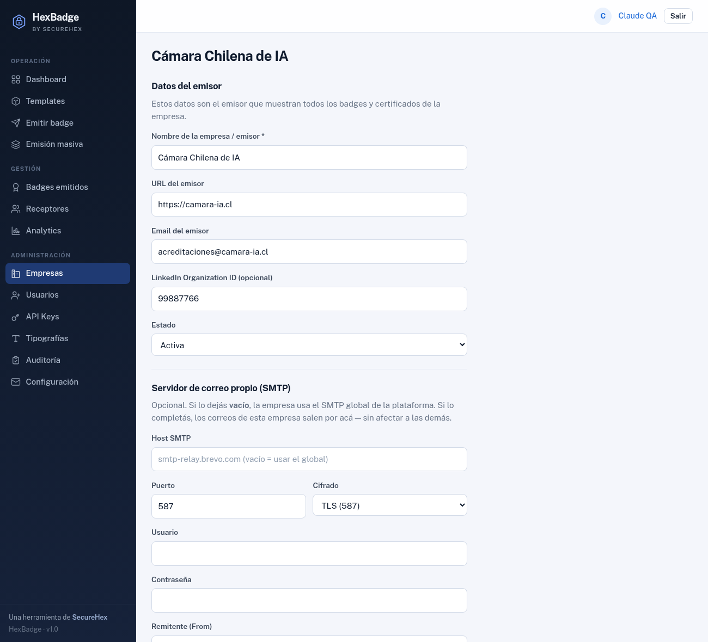

### Cuentas y seguridad
- **Roles jerárquicos**: `superadmin` › `admin` › `issuer` (ver tabla más abajo).
- **Alta por invitación** (sin registro abierto): el correo refleja la empresa y el rol.
- **2FA / TOTP opcional** (RFC 6238, compatible con Google Authenticator/Authy) para administradores y receptores.
- **Cuentas de receptor**: las personas se registran/loguean y reclaman sus badges de forma exclusiva.
- Cifrado AES-256-GCM para secretos (contraseñas SMTP), CSRF, rate limiting por IP, cookies `Secure`/`HttpOnly`, CSP y headers de seguridad.

### Gestión y operación
- **Dashboard** con métricas del mes y actividad reciente.
- **Listados** de badges y receptores con **búsqueda, filtros, paginación** y selector de cantidad por pantalla.
- **Analytics** (emisión por mes, aceptación por template, top receptores) con exportación a CSV.
- **Auditoría** de acciones, **API Keys** con scopes y **API REST v1** (Bearer, rate-limited).

---

## 📸 Capturas

| | |
|---|---|
| **Login** 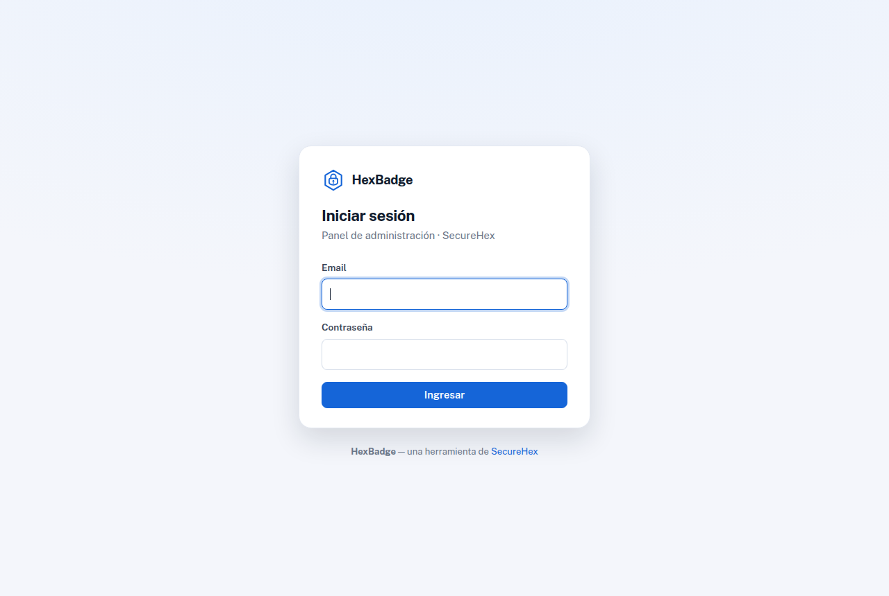 | **Dashboard** 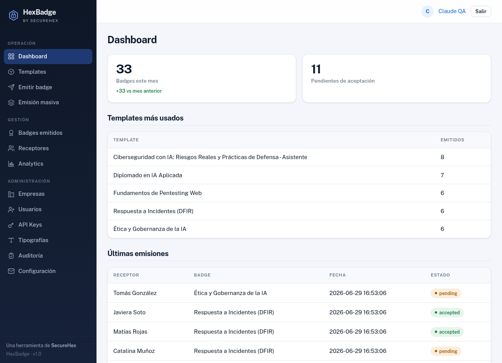 |
| **Templates (multiempresa)** 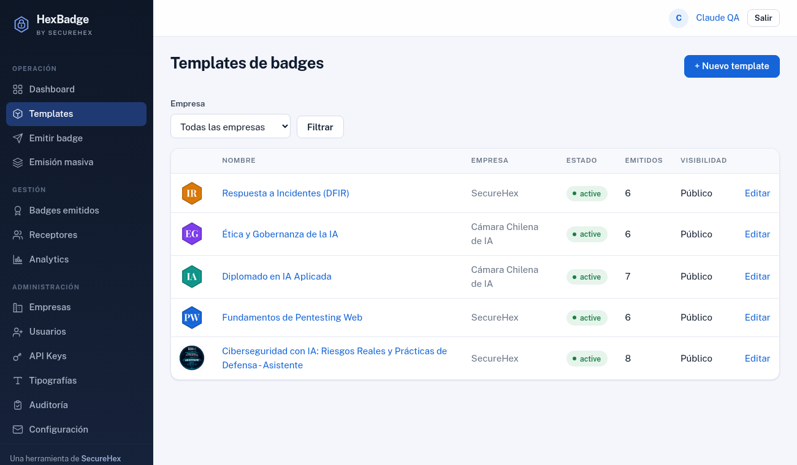 | **Emitir badge** 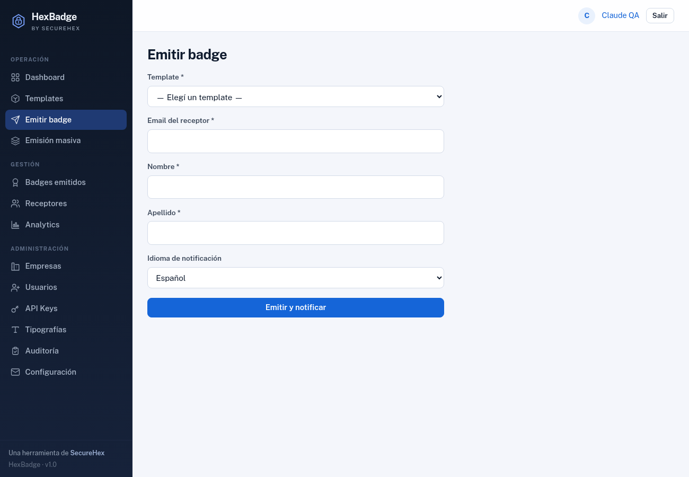 |
| **Badges emitidos** 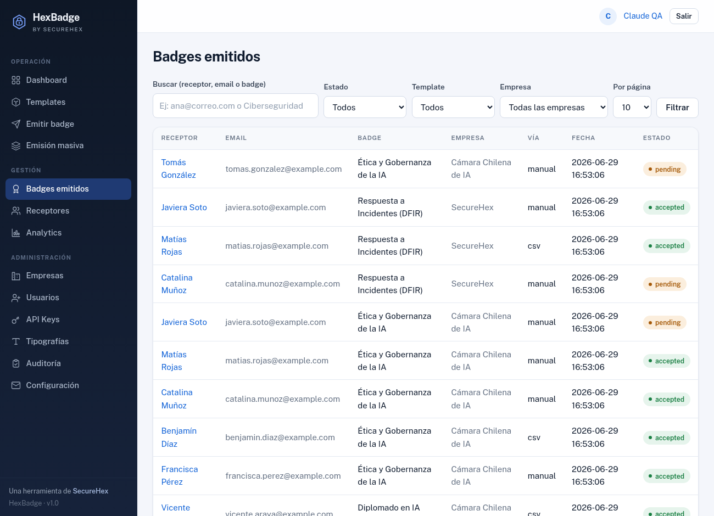 | **Receptores** 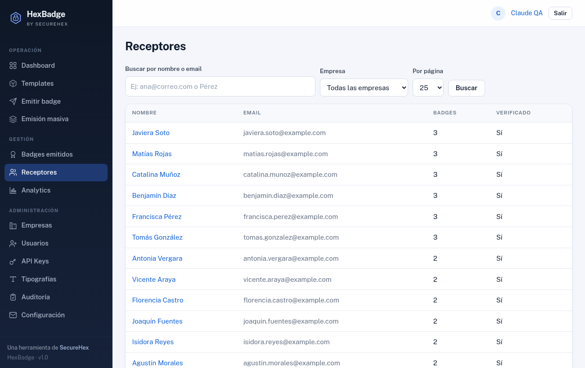 |
| **Analytics** 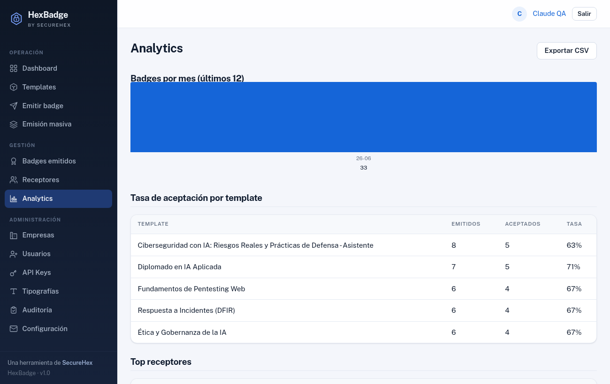 | **Empresas** 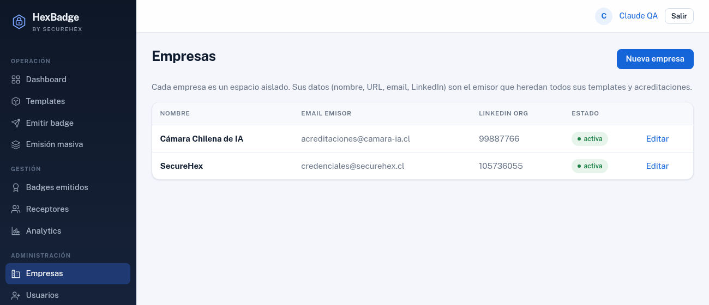 |
| **Usuarios e invitaciones** 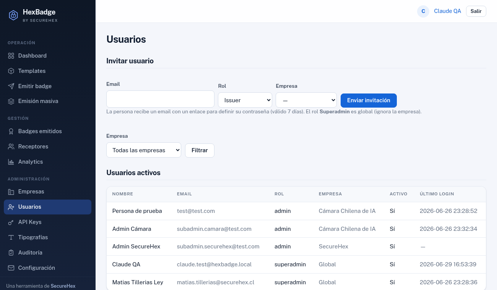 | **Portal público (landing)** 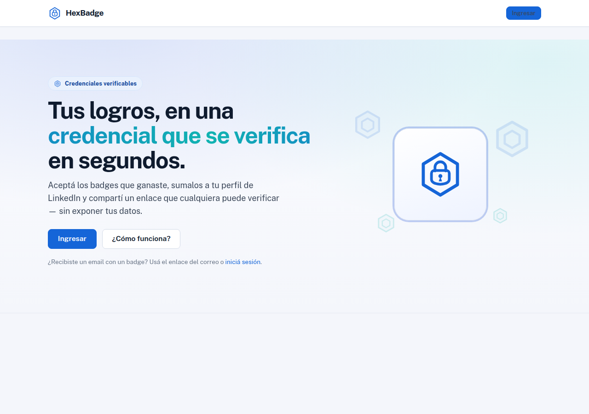 |

---

## 🧱 Stack y arquitectura

- **PHP 8.3** puro — sin frameworks, sin Composer, sin dependencias de binarios (`exec`).
- **MySQL 8.0**.
- **GD + FreeType** para imágenes/certificados; **cliente SMTP nativo**; **QR y TOTP en PHP puro**.
- Autoloader **PSR-4** propio (`HexBadge\` → `src/`).

**Dos aplicaciones** que comparten el mismo código y base de datos:

| App | Docroot | Para qué |
|---|---|---|
| **admin** | `apps/admin/public` | Panel interno: login, gestión, emisión, API |
| **earner** (público) | `apps/earner/public` | Verificación, imágenes de badges, wallet, landing |

Todo el resto (`src/`, `config/`, `database/`, `storage/`, `.env`) vive **fuera** de los docroots → inaccesible desde la web.

---

## 🚀 Instalación con Docker (desarrollo)

Requiere Docker + Docker Compose.

```bash
git clone <repo> hexbadge && cd hexbadge
docker compose up -d --build
```

Servicios que levanta:

| Servicio | URL | Qué es |
|---|---|---|
| **admin** | http://localhost:8088 | Panel de administración |
| **earner** | http://localhost:8089 | Portal público / verificación |
| **Mailpit** | http://localhost:8025 | Bandeja de correo de prueba (captura todos los emails) |
| **db** | `localhost:3306` | MySQL 8.0 |

Abrí **http://localhost:8088** → el **instalador web** te guía. Usá estos datos de la base (definidos en `docker-compose.yml`):

| Campo | Valor |
|---|---|
| DB host | `db` |
| DB nombre | `hexbadge` |
| DB usuario | `hexbadge_user` |
| DB contraseña | `hexbadge_dev_pass` |

Completá tu cuenta de **superadmin** y listo. Los correos no salen a internet: se ven en **Mailpit** (http://localhost:8025).

> ⚠️ Las credenciales del compose son **solo para desarrollo**. No las uses en producción.

---

## 🌐 Instalación en cPanel (producción)

HexBadge es PHP puro, así que corre en hosting compartido. Resumen (guía completa paso a paso en **[INSTALL-CPANEL.md](INSTALL-CPANEL.md)**):

1. **Subí el proyecto** a `/home/USUARIO/hexbadge/` (fuera de `public_html`).
2. **Base de datos** (MySQL® Databases): creá base y usuario con `ALL PRIVILEGES`. Host: `localhost`.
3. **Dos subdominios** apuntando a los docroots:
   - `badge.tudominio.cl` → `hexbadge/apps/admin/public`
   - `earner.tudominio.cl` → `hexbadge/apps/earner/public`
4. **PHP 8.3** (MultiPHP Manager) con `pdo_mysql`, `gd`, `fileinfo`, `openssl`.
5. **SSL/HTTPS** en ambos subdominios (obligatorio: la app fuerza cookies `Secure` y HSTS).
6. Abrí `https://badge.tudominio.cl` → **instalador web**: cargá URLs, datos de BD y tu superadmin. Crea el `.env`, ejecuta el schema, crea tu cuenta y se autobloquea.
7. **SMTP** desde el panel (Configuración) y configurá **SPF + DKIM** del dominio para que los correos lleguen.

> Sin Terminal/SSH: las migraciones de base se aplican desde **phpMyAdmin** (ver más abajo).

---

## 🔐 Roles

| Acción | Issuer | Admin | Superadmin |
|---|:--:|:--:|:--:|
| Crear templates / emitir badges / certificados | ✅ | ✅ | ✅ |
| Ver badges, receptores, dashboard, analytics | ✅ | ✅ | ✅ |
| Revocar badges | ❌ | ✅ | ✅ |
| Invitar usuarios (a su empresa) | ❌ | ✅ | ✅ |
| Auditoría · API Keys · tipografías | ❌ | ✅ | ✅ |
| Editar su empresa (datos + SMTP propio) | ❌ | ✅ | ✅ |
| Crear/editar Empresas · SMTP global | ❌ | ❌ | ✅ |
| **Datos que ve** | Solo su empresa | Solo su empresa | **Todas** |

---

## 🗄️ Base de datos y migraciones

- Esquema inicial: `database/schema.sql` (lo aplica el instalador).
- Migraciones incrementales: `database/migrations/00X_*.sql`.
- **Actualizar producción sin Terminal**: ejecutá `MIGRATION-PROD.sql` en phpMyAdmin. Es **idempotente** (lleva la base al día desde el primer MVP y se puede correr más de una vez sin romper ni duplicar).

---

## 📁 Estructura del proyecto

```
hexbadge/
├── apps/
│   ├── admin/public/      # docroot panel (badge.*)
│   └── earner/public/     # docroot público (earner.*)  + uploads/
├── src/
│   ├── Core/              # Router, Auth, DB, Crypto, QR, TOTP, Logger…
│   ├── Models/            # BadgeTemplate, IssuedBadge, Earner, Company…
│   ├── Services/          # BadgeService, EmailService, CertificateService…
│   ├── Admin/             # Controllers + Views del panel
│   └── Earner/            # Controllers + Views del portal público
├── config/                # un archivo por namespace (app, mail, db…)
├── database/              # schema.sql + migrations/
├── lib/fonts/             # tipografías built-in para certificados
├── storage/               # logs, mail spool, certificados, fuentes subidas
├── docs/screenshots/      # imágenes de este README
├── docker-compose.yml     # entorno de desarrollo
├── MIGRATION-PROD.sql     # puesta al día de producción (idempotente)
└── INSTALL-CPANEL.md      # guía de despliegue en cPanel
```

---

## 🤝 Contribuir y seguridad

- **¿Querés contribuir?** Leé la [guía de contribución](CONTRIBUTING.md): cómo levantar el entorno, las restricciones técnicas (PHP puro, sin Composer, compatible con cPanel) y el estilo de PRs.
- **¿Encontraste una vulnerabilidad?** **No abras un issue público.** Seguí la [política de seguridad](SECURITY.md) para reportarla de forma responsable.

## 🏷️ Créditos

Desarrollado para **SecureHex**. HexBadge es una herramienta de credenciales verificables construida en PHP puro, pensada para ser autoalojada y portable.
